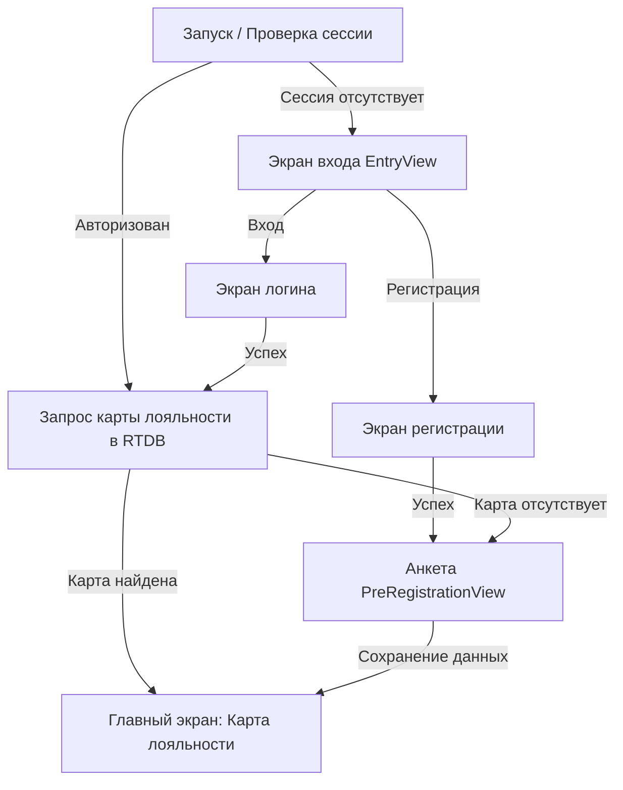

# ТЕХНИЧЕСКАЯ СПЕЦИФИКАЦИЯ: МИГРАЦИЯ ХУКЯР -> YARMINSK-IOS

## 1. Введение и цели проекта

### 1.1. Назначение
Проект **yarminsk-ios** представляет собой нативное iOS-приложение (Swift, SwiftUI), разработанное взамен кроссплатформенного приложения `hookYar` (Flutter). Приложение предназначено для гостей заведения в Минске и реализует электронную карту лояльности (клубную дисконтную карту) с динамическим QR-кодом, уровнями привилегий и личным кабинетом.

### 1.2. Ключевые цели
1. Полный отказ от Flutter в пользу нативного стека **Swift / SwiftUI / Swift Concurrency**.
2. **Абсолютная политика чистоты контента (Anti-Tobacco & Clean App Store Policy)**: 100% отсутствие любых упоминаний табака, кальянов, курения и смежных терминов как в кодовой базе (идентификаторы, комментарии, бандлы, файлы), так и в пользовательском интерфейсе (тексты, иконки, векторная графика, ссылки).
3. Архитектура, оптимизированная для **параллельной разработки несколькими AI-подагентами** без конфликтов слияния и блокировок.
4. Высокая производительность, плавные нативные анимации, поддержка Dynamic Island/SafeArea, поддержка Face ID / Apple Sign In.

---

## 2. Политика чистоты контента (Apple App Store Compliance)

> **КРИТИЧЕСКОЕ ТРЕБОВАНИЕ БЕЗОПАСНОСТИ:**
> В соответствии с правилами Apple App Store Review Guidelines (п. 1.4.3 "Tobacco and Vaping") и прямым требованием заказчика, в проекте **категорически запрещены** любые прямые или косвенные термины, связанные с табачной и кальянной продукцией.

### 2.1. Запрещенный словарь (Blacklist Regex)
В репозитории (включая имена коммитов, веток, файлов, папок, классов, переменных, ключей локализации и строковых ресурсов) запрещены подстроки:
- `hook` / `hookah` / `yarhookah`
- `kalyan` / `yarkalyan` / `кальян`
- `tabak` / `tabakoo` / `tobacco` / `табак` / `табачный`
- `smoke` / `smoking` / `курить` / `курение` / `дым`
- `vape` / `парить` / `вейп` / `сигар`

### 2.2. Таблица замены терминов (Term Mapping)

| Термин в старом проекте | Новый термин в `yarminsk-ios` | Контекст |
|---|---|---|
| `Яркальян` / `ЯРКАЛЬЯН` | `Яр Минск` / `Yar Minsk` / `ЯР` | Название приложения, заголовок карточки |
| `yarhookah` | `YarMinsk` | Имя таргета, проекта, репозитория |
| `com.yarkalyan.yarhookah` | `by.yarminsk.app` (или `com.yarminsk.app`) | Bundle Identifier |
| `assets/images/logo.png` (со словом «ЯРКАЛЬЯН») | Векторный/растровый знак **ЯР** (без нижнего текста «ЯРКАЛЬЯН») | Логотип и сплеш |
| `goldCard.svg` / `silverCard.svg` / `platinumCard.svg` (содержащие контуры букв «ЯРКАЛЬЯН») | Нативные векторные градиенты SwiftUI (`LinearGradient`) | Карточки уровней |
| `https://yarkalyan.by/appprivacy` | `https://yarminsk.by/privacy` (или настраиваемый config/remote параметр) | Политика конфиденциальности |
| `Hookah lounge` | `Lounge club` / `Клубное пространство` / `Гостевой сервис` | Описание и метаданные |

### 2.3. Автоматический контроль чистоты (Compliance Linter)
В проект включается скрипт `scripts/verify_clean_code.sh`, который перед коммитом и в CI сканирует всю директорию проекта:
```bash
#!/usr/bin/env bash
FORBIDDEN_PATTERN="(hook|kalyan|tabak|tobac|smok|vape|курит|кальян|табак|парит)"
if grep -riE "$FORBIDDEN_PATTERN" Sources Resources 2>/dev/null; then
    echo "❌ ОШИБКА: Обнаружены запрещенные слова!"
    exit 1
fi
echo "✅ Кодовая база чиста."
```

---

## 3. Технологический стек

- **Язык**: Swift 6 (режим строгой изоляции акторов Swift 6 Concurrency)
- **UI Фреймворк**: SwiftUI (iOS 16.0+)
- **Архитектурный паттерн**: Clean Architecture + MVVM (State Object / Observable)
- **Dependency Injection**: Протокол-ориентированный Service Container (без тяжелых внешних библиотек)
- **Менеджер зависимостей**: Swift Package Manager (SPM)
- **Внешние библиотеки (минимальный набор)**:
  - `firebase-ios-sdk` (версии 11.x):
    - `FirebaseAuth` (Аутентификация по почте, Apple, Google)
    - `FirebaseDatabase` (Realtime Database для чтения и создания карт)
  - `GoogleSignIn-iOS` (Google Sign-In для iOS)
- **Встроенные системные фреймворки (Zero Dependency)**:
  - `AuthenticationServices` — Sign in with Apple
  - `CoreImage.CIFilterBuiltins` — Генерация QR-кода на лету
  - `Security` (Keychain) — Безопасное хранение пользовательских токенов и сессий
  - `Combine` / `Observation` — Реактивная привязка состояний

---

## 4. Архитектура приложения и Модель Данных

### 4.1. Слои архитектуры
```
┌────────────────────────────────────────────────────────┐
│                   Presentation Layer                   │
│   SwiftUI Views + ViewModels (@Observable / @MainActor)│
├────────────────────────────────────────────────────────┤
│                      Domain Layer                      │
│   UseCases + Domain Models + Repository Protocols       │
├────────────────────────────────────────────────────────┤
│                       Data Layer                       │
│   Firebase RTDB / Auth / Keychain / UserDefaults       │
└────────────────────────────────────────────────────────┘
```

### 4.2. Доменные сущности (Domain Entities)

#### UserProfile
```swift
public struct UserProfile: Identifiable, Codable, Equatable, Sendable {
    public let id: String // Firebase UID
    public var name: String
    public var lastName: String
    public var email: String
    public var phone: String
    public var photoUrl: URL?

    public var displayName: String {
        "\(name) \(lastName)".trimmingCharacters(in: .whitespaces)
    }

    public var isValid: Bool {
        !name.isEmpty && !lastName.isEmpty && !phone.isEmpty && !email.isEmpty
    }
}
```

#### DiscountCard & DiscountTier
```swift
public enum DiscountTier: String, Codable, CaseIterable, Sendable {
    case silver
    case gold
    case platinum
    case unknown

    public static func tier(for percentage: Double) -> DiscountTier {
        switch percentage {
        case 0...10: return .silver
        case 11...20: return .gold
        case 21...100: return .platinum
        default: return .unknown
        }
    }

    public var title: String {
        rawValue.uppercased()
    }
}

public struct DiscountCard: Identifiable, Codable, Equatable, Sendable {
    public let id: String
    public let userId: String
    public let cardHolder: String
    public let discount: Double
    public let qrData: String
    public let phone: String

    public var tier: DiscountTier {
        DiscountTier.tier(for: discount)
    }
}
```

### 4.3. База данных (Firebase Realtime Database)
- **Узел хранения**: `/discount/{userId}`
- **Структура записи**:
  ```json
  {
    "id": "UUID-V4-STRING",
    "cardHolder": "ИВАН ИВАНОВ",
    "discount": 10.0,
    "qrData": "A1B2C3",
    "phone": "+375291234567"
  }
  ```
  *(Примечание: `qrData` формируется как первые 6 символов сгенерированного UUID карточки).*

---

## 5. Экраны и Пользовательские Сценарии

### 5.1. Поток авторизации и старта (Flow)


### 5.2. Спецификация экранов

1. **Экран входа (`EntryView`)**:
   - Верхняя часть: Лаконичный логотип **ЯР** (без запрещенных надписей).
   - Кнопки: «ВОЙТИ» (Outline кнопка) и «ЗАРЕГИСТРИРОВАТЬСЯ» (Outline кнопка).
   - Подвал: Кнопка «Политика конфиденциальности».

2. **Экран входа по логину (`SignInView`)**:
   - Навигация: Кнопка возврата «НАЗАД», заголовок «АВТОРИЗАЦИЯ».
   - Поля ввода: Email, Пароль (с переключателем видимости).
   - Валидация: Проверка email регулярным выражением, длина пароля >= 6.
   - Кнопка действия: «ВОЙТИ» (активна только при валидных полях).
   - Отображение ошибок API (неверные учетные данные, нет сети).

3. **Экран регистрации (`SignUpView`)**:
   - Навигация: Кнопка возврата «НАЗАД», заголовок «РЕГИСТРАЦИЯ».
   - Поля ввода: Email, Пароль.
   - Разделитель «ИЛИ».
   - Кнопки социальных провайдеров: «Войти с помощью Apple» и «Войти с помощью Google».
   - Кнопка действия: «ЗАРЕГИСТРИРОВАТЬСЯ».

4. **Экран анкетирования профиля (`PreRegistrationView`)**:
   - Заголовок: «ЗАПОЛНИТЕ ИНФОРМАЦИЮ».
   - Поле ввода «Имя» (капитализация первой буквы, макс. 30 символов).
   - Поле ввода «Фамилия» (капитализация первой буквы, макс. 30 символов).
   - Поле выбора страны и телефона:
     - Беларусь: префикс `+375`, маска `XX XXX-XX-XX` (9 цифр).
     - Россия: префикс `+7`, маска `XXX XXX-XX-XX` (10 цифр).
   - Поле «Email» (предустановлено из аккаунта).
   - Чекбокс согласия: «Соглашаюсь на обработку и хранение персональных данных».
   - Кнопка «ЗАРЕГИСТРИРОВАТЬСЯ»: активна строго при валидных ФИО, телефоне и отмеченном чекбоксе.
   - Логика: Обновление профиля в Firebase Auth -> Создание карты со скидкой 10% в `/discount/{userId}` -> Переход на главный экран.

5. **Главный экран (`HomeView` / `DiscountCardView`)**:
   - Верхний бар (`HomeAppBar`):
     - Слева: Аватар пользователя (загрузка по photoUrl или дефолтная векторная иконка в круге с белой рамкой).
     - По центру: Логотип **ЯР**.
     - Справа: Иконка бургер-меню.
   - Выдвижное меню (`HomeDrawer`):
     - Кнопка закрытия (крестик).
     - Кнопка «ВЫЙТИ» внизу справа -> вызов модального диалога:
       - «Вы действительно хотите выйти?»
       - Кнопки: «ОСТАТЬСЯ» и «ВЫЙТИ» (очистка сессии, сброс к экрану входа).
   - Основная область (`DiscountCardView`):
     - Стильная темная карточка со скруглением (24 pt) и радиальным/линейным градиентом.
     - Заголовок: Логотип и текст **«ЯР МИНСК»**.
     - Тонкий разделитель.
     - Статус карты: `SILVER` / `GOLD` / `PLATINUM` с фирменным золотым/серебряным/платиновым градиентным текстом.
     - Имя держателя карты в верхнем регистре (`ДЕРЖАТЕЛЬ КАРТЫ`).
     - Процент скидки: `10%` (`СКИДКА`).
     - Центрированный QR-код (200x200 pt), сгенерированный системным CoreImage из `qrData`.
     - Поддержка `Pull-to-refresh` для синхронизации с базой данных.
     - Shimmer/Skeleton эффект при загрузке.

---

## 6. Дизайн-система (Design System Tokens)

### 6.1. Шрифты (Typography)
Семейство шрифтов: **Oswald** (подключается через Info.plist в `Resources/Fonts/`):
- `Oswald-ExtraLight` (200)
- `Oswald-Light` (300)
- `Oswald-Regular` (400)
- `Oswald-Medium` (500)
- `Oswald-SemiBold` (600)
- `Oswald-Bold` (700)

Стили типографики (SwiftUI Font Extensions):
- `headline1`: Oswald-SemiBold, 64 pt
- `headline2`: Oswald-SemiBold, 48 pt
- `headline3`: Oswald-Regular, 32 pt
- `headline4`: Oswald-SemiBold, 20 pt
- `bodyLBold` / `bodyLMedium` / `bodyLRegular`: Oswald 24 pt
- `bodyMBold` / `bodyMMedium` / `bodyMRegular`: Oswald 20 pt
- `bodySBold` / `bodySMedium` / `bodySRegular`: Oswald 16 pt
- `bodyXSBold` / `bodyXSMedium` / `bodyXSRegular`: Oswald 12 pt

### 6.2. Цветовая палитра (`Color+Theme.swift`)
- `subject00`: `#FFFFFF` (Белый)
- `subject80`: `#2E3332` (Темно-серый)
- `subject90`: `#141A19` (Глубокий темный)
- `subject95`: `#101010` (Фоновый)
- `subject100`: `#000000` (Черный)
- `brandSecondary`: `Color(red: 49/255, green: 127/255, blue: 83/255)` (Изумрудно-зеленый акцент)
- `cardBackgroundGradient`: Линейный градиент от `#1A1A1A` через `#2B2B2B` к `#3A3A3A`
- `goldGradient`: Градиент золота `[#FFD700, #FFA500, #FFEC8B]`
- `silverGradient`: Градиент серебра `[#CFD8DC, #B0BEC5, #ECEFF1]`
- `platinumGradient`: Градиент платины `[#F0F8FF, #D9E4EC, #B0C4DE, #DCDCDC]`

---

## 7. План реализации через независимых параллельных подагентов

Для устранения конфликтов одновременной работы и гарантированной независимости, проект разделен на **четко изолированные модули и зоны ответственности**.

### 7.1. Схема разделения зон ответственности подагентов

```
yarminsk-ios/
├── Project.swift / YarMinsk.xcodeproj
├── Resources/
│   ├── Fonts/                          <-- Агент A
│   ├── Assets.xcassets/                <-- Агент A
│   └── GoogleService-Info.plist        <-- Агент A/Lead
├── Sources/
│   ├── Core/                           <-- Агент B (Интерфейсы, модели, хранилище)
│   │   ├── Models/
│   │   ├── Protocols/
│   │   └── Storage/
│   ├── DesignSystem/                   <-- Агент A (Цвета, шрифты, компоненты UI)
│   │   ├── Tokens/
│   │   └── Components/
│   ├── Services/                       <-- Агент B (Firebase Auth & Database)
│   │   ├── Firebase/
│   │   └── Mocks/
│   ├── Features/
│   │   ├── Auth/                       <-- Агент C (Вход, регистрация, валидация)
│   │   │   ├── Views/
│   │   │   └── ViewModels/
│   │   └── Loyalty/                    <-- Агент D (Карта, QR, анкета, Home, Drawer)
│   │       ├── Views/
│   │       └── ViewModels/
│   └── App/                            <-- Агент Lead / Интегратор
│       ├── YarMinskApp.swift
│       └── AppRouter.swift
```

### 7.2. Детальные задачи для подагентов

#### 🤖 Подагент A: Design System, UI Components & Assets
- **Роль**: Архитектор дизайн-системы и визуальных ресурсов.
- **Входные данные**: Шрифты Oswald, цветовая палитра из Flutter-проекта, векторные иконки.
- **Зона ответственности (только свои файлы)**:
  - Папка `Sources/DesignSystem/`:
    - `Color+Theme.swift` (все цветовые токены и градиенты).
    - `Font+Oswald.swift` (настройка кастомных шрифтов Oswald и масштабирования).
    - `PrimaryButton.swift` и `OutlineButton.swift` (стилизованные кнопки).
    - `YarTextField.swift` (текстовые поля с лейблом, подсказкой и иконкой скрытия пароля).
    - `PhoneInputField.swift` (выбор BY/RU флагов, динамическая маска ввода).
    - `ShimmerView.swift` (эффект скелетной анимации).
    - `QRCodeView.swift` (CoreImage генератор QR-кода высокого разрешения).
    - `YarCheckbox.swift` (согласие на обработку данных).
  - Папка `Resources/`:
    - Добавление шрифтов Oswald в проект.
    - Очищенный ассет логотипа **ЯР** (удаление букв «ЯРКАЛЬЯН»).
    - Иконки: профиль, бургер-меню, стрелка назад, крестик, логотипы Apple и Google.
- **Критерий готовности**: Все UI-компоненты компилируются и имеют работающие SwiftUI `@Previewable` превью с моковыми данными.

#### 🤖 Подагент B: Core Domain, Storage & Services (Firebase Layer)
- **Роль**: Инженер слоя данных и сетевых сервисов.
- **Входные данные**: Firebase RTDB схема (`/discount/{userId}`), Firebase Auth API.
- **Зона ответственности (только свои файлы)**:
  - Папка `Sources/Core/`:
    - Модели: `UserProfile`, `DiscountCard`, `DiscountTier`, `AuthSession`.
    - Регулярные выражения валидации: `ValidationRules.swift` (email, пароль, имя, телефоны).
    - Протоколы:
      - `AuthServiceProtocol` (signIn, signUp, signInWithApple, signInWithGoogle, logOut).
      - `DiscountServiceProtocol` (fetchDiscountCard, createDiscountCard).
      - `SessionStorageProtocol` (saveToken, getToken, clearToken via Keychain).
  - Папка `Sources/Services/`:
    - `FirebaseAuthService.swift` (интеграция с `FirebaseAuth` и `AuthenticationServices`).
    - `FirebaseDiscountService.swift` (интеграция с `FirebaseDatabase`).
    - `KeychainSessionStorage.swift` (безопасное хранилище).
    - `MockAuthService.swift` и `MockDiscountService.swift` (полноценные мок-реализации для работы офлайн, тестов и превью).
- **Критерий готовности**: Модели Codable покрыты тестами; мок-сервисы и боевые сервисы реализуют единые протоколы без внешних зависимостей от UI.

#### 🤖 Подагент C: Feature Auth (Вход и Регистрация)
- **Роль**: Разработчик фичи аутентификации.
- **Зависимости**: Использует компоненты из `DesignSystem` и протоколы из `Core/Protocols`.
- **Зона ответственности (только свои файлы)**:
  - Папка `Sources/Features/Auth/`:
    - `AuthViewModel.swift` (управление состоянием, вызовы `AuthServiceProtocol`, валидация полей).
    - `EntryView.swift` (начальный приветственный экран с логотипом).
    - `SignInView.swift` (форма логина по email/паролю).
    - `SignUpView.swift` (форма регистрации по email/паролю + Social Auth).
    - Обработка ошибок (неверный пароль, пользователь уже существует, ошибки сети).
- **Критерий готовности**: Полноценный изолированный флоу регистрации и входа, работающий как на реальном сервисе, так и на `MockAuthService`.

#### 🤖 Подагент D: Feature Loyalty & Home (Анкета, Карта лояльности, Меню)
- **Роль**: Разработчик главной фичи карт лояльности и кабинета.
- **Зависимости**: Использует компоненты из `DesignSystem` и протоколы из `Core/Protocols`.
- **Зона ответственности (только свои файлы)**:
  - Папка `Sources/Features/Loyalty/`:
    - `LoyaltyViewModel.swift` (загрузка карты, обновление данных, регистрация новой карты через анкету).
    - `PreRegistrationView.swift` (анкета ФИО, телефон с маской, чекбокс согласия).
    - `DiscountCardView.swift` (отрисовка карточки с градиентами, именем, процентом, QR-кодом и shimmer).
    - `HomeView.swift` (корневой экран с безопасной зоной).
    - `HomeAppBar.swift` (аватар, логотип, кнопка меню).
    - `HomeDrawer.swift` (шторка меню с диалогом подтверждения выхода).
- **Критерий готовности**: Корректная отрисовка карты лояльности с живым QR-кодом, pull-to-refresh, анкетирование и выход из аккаунта.

#### 🤖 Подагент Lead / Интегратор: Сборка, Роутинг и Compliance-аудит
- **Роль**: Ведущий архитектор.
- **Зона ответственности**:
  - Инициализация проекта Xcode / Package.swift.
  - `Sources/App/AppRouter.swift` (переключение между Auth, Questionnaire и Home).
  - `Sources/App/YarMinskApp.swift` (инициализация Firebase, DI Container).
  - Скрипт `scripts/verify_clean_code.sh` (проверка отсутствия запрещенных слов).
  - Сборка таргета через `xcodebuild` и прогон тестов.

---

## 8. Матрица тестирования и Приемочные Критерии (Acceptance Criteria)

1. **Clean Code & Asset Audit**:
   - Ни в одном файле исходного кода `.swift`, `.json`, `.plist`, `.svg`, `.xcassets` нет упоминаний запрещенных слов.
   - Скрипт `verify_clean_code.sh` завершается с кодом 0.
2. **Аутентификация**:
   - Успешный вход/регистрация по Email + пароль.
   - Поддержка Sign in with Apple с нативным системным диалогом.
   - Поддержка Google Sign In.
   - Валидация некорректного email и слабого пароля.
3. **Анкета и Генерация карты**:
   - При первом входе без карты открывается экран анкеты.
   - Маска телефона корректно переключается между Беларусью (+375) и РФ (+7).
   - Кнопка создания карты неактивна без чекбокса согласия.
   - Запись карты сохраняется в Firebase RTDB `/discount/{uid}`.
4. **Отображение карты**:
   - QR-код рендерится из первых 6 символов ID карты.
   - Отображаются корректный уровень (Silver/Gold/Platinum), процент скидки и ФИО.
   - Pull-to-refresh обновляет состояние карты с базы данных.
5. **Выход из приложения**:
   - Кнопка выхода в выдвижном меню вызывает диалог подтверждения.
   - При подтверждении токен очищается, и происходит мгновенный возврат на экран входа.
